# ⚡ LeetCode Live Streak Widget & Portfolio Dashboard

A premium, interactive, and real-time LeetCode portfolio dashboard and dynamic SVG card generator designed to level up your GitHub Profile README.

### 🎨 Live Customizer Dashboard Demo
*Includes a React customizer panel to select themes, adjust configurations, and copy auto-generated markdown embed codes.*

<p align="center">
  
</p>

---

## 🚀 Two Modes of Operation

This repository gives you the best of both worlds:
1. **Live Dynamic Serverless API (Recommended)**: Hosted on Vercel, it fetches statistics in real-time on-demand directly from LeetCode, computes streak and active progression dynamically, and serves the SVG instantly with custom theme parameters.
2. **Offline Static GitHub Action**: Runs automatically every 6 hours via GitHub Actions, executes the Python script, and commits a static SVG to your repository.

---

## 🛠️ Option 1: Live Dynamic Vercel Widget (Real-time Updates)

Deploy this project to Vercel to activate the live card customizer website and get a dynamic image link that updates instantly as you solve problems.

### 1. Deploy to Vercel
Click the button below to deploy this repository to your Vercel account with one click:

[](https://vercel.com/new/clone?repository-url=https%3A%2F%2Fgithub.com%2Fapumukherjee819%2Fleetcode-streak-widget)

### 2. Embed Code
Once deployed, copy the markdown below and paste it into your profile README (replace `YOUR_VERCEL_DOMAIN` and `apumukherjee819` with your values):

```markdown
[](https://leetcode.com/apumukherjee819)
```

### 3. URL Parameters

| Parameter | Description | Default | Values |
| :--- | :--- | :--- | :--- |
| `username` | Your LeetCode username | `apumukherjee819` | String |
| `theme` | Color theme for the dashboard card | `dark` | `dark`, `cyberpunk`, `nord`, `sunset`, `neon`, `glassmorphism` |
| `timezone` | Timezone database string to calculate streaks | `UTC` | `Asia/Kolkata`, `America/New_York`, `UTC`, etc. |

---

## ⚙️ Option 2: Static Python & GitHub Action Workflow (Zero Setup)

If you prefer a zero-dependency static setup, the pre-configured GitHub Actions workflow will update your repository's static card automatically.

1. **Fork or Push** this repository to your GitHub profile.
2. The GitHub Action workflow is configured in `.github/workflows/leetcode_stats.yml` and runs automatically every 6 hours (`0 */6 * * *`).
3. It runs `generate_leetcode_stats.py` to generate the file `leetcode_stats.svg`.
4. To embed this static SVG directly in your README, use:
   ```markdown
   [](https://leetcode.com/apumukherjee819)
   ```

### Running Locally

To generate the SVG locally, make sure you have `requests` installed:
```bash
pip install requests
python generate_leetcode_stats.py --username apumukherjee819 --theme cyberpunk --output leetcode_stats.svg
```

---

## 🎭 Theme Showcase

Our widget supports multiple premium, hand-crafted themes:
*   **Dark Modern (`dark`)**: GitHub's signature dark palette with green, yellow, and red accents.
*   **Cyberpunk (`cyberpunk`)**: Futuristic neon pink borders with teal and yellow highlights.
*   **Nord Frost (`nord`)**: Cozy and clean Arctic palette with pastel tones.
*   **Sunset Glow (`sunset`)**: Deep plum backgrounds with beautiful fuchsia and orange gradients.
*   **Neon Toxic (`neon`)**: Pitch black background with bright fluorescent green, blue, and pink.
*   **Glassmorphism (`glassmorphism`)**: Sleek transparent background that blends with your GitHub theme.

---

## 👨‍💻 Tech Stack
- **Frontend**: React, TypeScript, Vite, Vanilla CSS
- **Backend API**: Vercel Serverless Functions (Node.js)
- **Local Automation**: Python, GitHub Actions
- **Graphics**: SVG, CSS keyframe animations

---

*Dashboard designed & maintained by Apurva Mukherjee*
